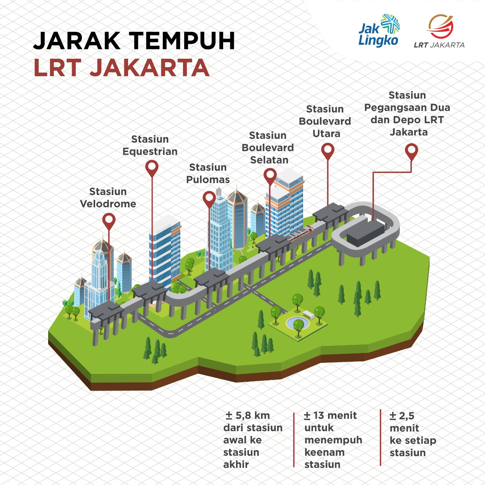
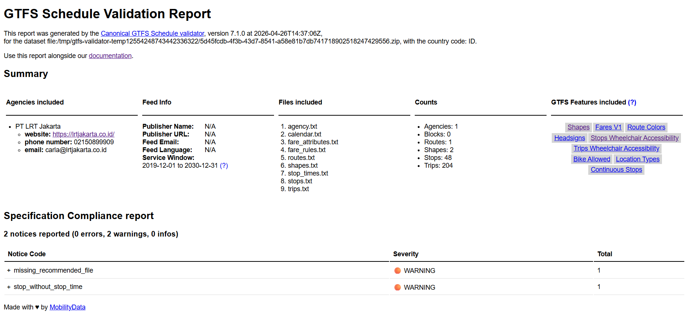

---

## Table of Contents
- [Build GTFS](#build-gtfs)
- [ Profil LRT Jakarta Lin Selatan Fase 1A](#-profil-lrt-jakarta-lin-selatan-fase-1a)
- [Data](#data)
  - [Jadwal Keberangkatan](#jadwal-keberangkatan)
  - [Stop (Stasiun, Platform, Entrance)](#stop-stasiun-platform-entrance)
  - [Shape / Jalur](#shape--jalur)
  - [Tarif Perjalanan](#tarif-perjalanan)
- [How to Run](#how-to-run)
- [Validation GTFS](#validation-gtfs)
- [License](#license)


# Build GTFS

[**`General Transit Feed Specification (GTFS)`**](https://developers.google.com/transit/gtfs/) adalah standar format data yang digunakan untuk mendeskripsikan informasi transportasi publik seperti rute, jadwal, dan halte/stasiun dalam bentuk file teks yang terstruktur.

GTFS terdiri dari kumpulan file **CSV (Comma-Separated Values)** dengan ekstensi `.txt` yang dikompres menjadi satu file `.zip`. Setiap file memiliki skema kolom tertentu yang telah distandarisasi. GTFS terdiri dari dua Varian Utama yaitu:

- `GTFS Static`, data statis yang menggambarkan "rencana" layanan transportasi tidak berubah secara real-time. Biasanya diperbarui secara berkala (mingguan/bulanan) ketika ada perubahan jadwal atau rute.
- `GTFS Realtime`, data dinamis yang menggambarkan kondisi aktual layanan saat ini (Realtime). Menggunakan format Protocol Buffers (protobuf), diperbarui setiap beberapa detik hingga menit. Dengan GTFS-Realtime, Informasi keterlambatan, pembatalan, perubahan jadwal perjalanan dapat diketahui secara live, selain itu dapat mengetahui posisi GPS kendaraan secara real-time di peta. GTFS Realtime tidak bisa berdiri sendiri, membutuhkan GTFS Static sebagai acuan.

File GTFS dapat langsung digunakan pada routing engine seperti **OpenTripPlanner (OTP)**, **Google Maps**, atau platform transit lainnya yang mendukung format GTFS.

*Dokumentasi Resmi:* [GTFS Reference](https://gtfs.org/documentation/overview/)

---

Pada repositori ini akan dijelaskan proses *build* file GTFS pada satu  jupyter notebook (.ipnyb) yang mencakup seluruh proses pembuatan `GTFS Static` untuk operasi layanan **`LRT Jakarta Lin Selatan Fase 1A`**  dalam satu alur kerja yang terdokumentasi secara lengkap. Berikut ini file yang akan di-*build* pada notebook ini:

| File | Status | Deskripsi Singkat |
|------|--------|------------------|
| `agency.txt` | ✅ Required | Informasi operator (PT LRT Jakarta) |
| `stops.txt` | ✅ Required | Data perihal stasiun (nama, koordinat, zona) |
| `routes.txt` | ✅ Required | Data rute/layanan (warna, tipe, referensi agency) |
| `trips.txt` | ✅ Required | Data perjalanan spesifik (route, direction) |
| `stop_times.txt` | ✅ Required | Jadwal kedatangan/keberangkatan di tiap stasiun |
| `calendar.txt` | ⚠️ Conditional | Jadwal operasional reguler (Senin-Minggu) |
| `fare_attributes.txt` | ❌ Optional | Informasi tarif/ticketing |
| `fare_rules.txt` | ❌ Optional | Aturan penerapan tarif |
| `shapes.txt` | ❌ Optional | Koordinat polyline untuk visualisasi rute di peta |

---

Setelah notebook selesai dijalankan, project ini akan memiliki struktur seperti ini:

```
gtfs_lrt_jakarta/
├── agency.txt
├── calendar.txt
├── fare_attributes.txt
├── fare_rules.txt
├── routes.txt
├── shapes.txt
├── stops.txt
├── stop_times.txt
└── trips.txt
```


#  Profil LRT Jakarta Lin Selatan Fase 1A


*source: [Transport for Jakarta – Forum Diskusi Transportasi Jakarta (TFJ-FDTJ)](https://transportforjakarta.or.id/)*


---
| Profil | Detail |
|---|---|
| Jenis Layanan | Light Rapid Transit |
| Operator | PT LRT Jakarta (Perseroda) |
| Short Name | LRTJ |
| Website | https://lrtjakarta.co.id/ |
| Telepon | 1500-332 |
| Email | customer.care@jakartalrt.co.id |
| Lin | Selatan Fase 1A |
| Kode Lin | S *(South)* |
| Warna Lin |    |
| Depo | Pegangsaan Dua |
| Terminus Utara | Stasiun Pegangsaan Dua (S01) |
| Terminus Selatan | Stasiun Velodrome (SO6) |
| Jumlah Stasiun | 6 stasiun |
| Panjang Jalur | ±5,8 km |
| Karakteristik Lintas | Layang |
| Lebar Sepur | 1.435 mm |
| Headway | 10 menit  |
| Tarif | Rp5.000 (Flat) |
| Jam Operasi | 05.30 – 23.00 WIB |
| Mulai Beroperasi | 1 Desember 2019 |



*source: [Website Resmi LRT Jakarta](https://www.lrtjakarta.co.id/)*

**`Daftar Stasiun`**

| No | Nama Stasiun | Short Name | Kode Stasiun |
|:---:|---|:---:|:---:|
| 1 | Pegangsaan Dua | PGD | S01 |
| 2 | Boulevard Utara Summarecon Mall | BVU | S02 |
| 3 | Boulevard Selatan | BVS | S03 |
| 4 | Pulomas | PUM | S04 |
| 5 | Equestrian | EQS | S05 |
| 6 | Velodrome | VEL | S06 |


# Data

Data berikut menjadi dasar dalam membuat file GTFS LRT Jakarta Lin Selatan Fase 1A.

## Jadwal Keberangkatan

Data jadwal keberangkatan bersumber dari [website resmi LRT Jakarta](https://www.lrtjakarta.co.id/jadwal.html) dan telah dikonversi ke format CSV dengan pengelompokan sebagai berikut:

- Arah perjalanan (Pegangsaan Dua → Velodrome dan sebaliknya)
- Diurutkan berdasarkan waktu keberangkatan
- Setiap keberangkatan dianggap sebagai **1 trip**
- Jadwal LRT Jakarta tidak ada perbedaan baik itu weekday/weekend

Data jadwal hasil pengelompokan tersedia di [`data/jadwal-keberangkatan/`](data/jadwal-keberangkatan/).

| Jenis Trip | Asal | Tujuan | Jumlah Trip |
|---|---|---|:---:|
| Full trip | Pegangsaan Dua | Velodrome | 102 |
| Full trip | Velodrome | Pegangsaan Dua | 102 |
| **Total** | | | **204** |

Terkait dengan nama `trip_id` berikut ini format yang digunakan:

Penamaan `trip_id` terdiri dari 5 komponen yang dipisahkan tanda hubung (`-`):

```
S  -  ED  -  PGD  -  VEL  -  001
│      │      │       │       │
│      │      │       │       └── Nomor urut keberangkatan (3 digit, mulai 001)
│      │      │       └────────── Kode stasiun tujuan
│      │      └────────────────── Kode stasiun asal
│      └───────────────────────── Jenis hari operasi (ED)
└──────────────────────────────── Kode Lin
```

Catatan:

* Format trip_id di atas merupakan inisiatif penyusunan sendiri untuk kebutuhan pengolahan data GTFS dan bukan standar resmi dari operator LRT Jakarta.
* Operator LRT Jakarta kemungkinan memiliki sistem penamaan internal tersendiri, seperti nomor perjalanan kereta (train number / nomor kereta) dengan aturan khusus yang tidak dipublikasikan secara umum.
* Oleh karena itu, trip_id dalam dataset ini bersifat custom dan digunakan semata untuk keperluan identifikasi unik tiap perjalanan dalam GTFS.


## Stop (Stasiun, Platform, Entrance)

Data ini berisi informasi seluruh titik pemberhentian dalam sistem LRT Jakarta yang mencakup level stasiun (parent station), platform (boarding area), hingga entrance (akses masuk/keluar). Data ini digunakan untuk membangun struktur hierarki `stops.txt` dalam GTFS, memastikan keterkaitan antar elemen serta akurasi lokasi geografis setiap titik layanan penumpang. Seluruh titik koordinat (node) setiap stop diperoleh dari data `OpenStreetMap (OSM)` yang bersifat open source.

| Nama Stop | Tipe | Platform | Node OSM |
|---|---|:---:|---|
| Stasiun LRT Pegangsaan Dua | Parent station | — | https://www.openstreetmap.org/node/5984702931 |
| Stasiun LRT Pegangsaan Dua | Platform | 1 | https://www.openstreetmap.org/node/11630425911 |
| Stasiun LRT Pegangsaan Dua | Platform | 2 | https://www.openstreetmap.org/node/11630425912 |
| Stasiun LRT Pegangsaan Dua Akses A | Entrance | — | https://www.openstreetmap.org/node/13751649255 |
| Stasiun LRT Pegangsaan Dua Akses B | Entrance | — | https://www.openstreetmap.org/node/13751649256 |
| Stasiun LRT Boulevard Utara Summarecon Mall | Parent station | — | https://www.openstreetmap.org/node/5984702926 |
| Stasiun LRT Boulevard Utara Summarecon Mall | Platform | 1 | https://www.openstreetmap.org/node/6196137582 |
| Stasiun LRT Boulevard Utara Summarecon Mall | Platform | 2 | https://www.openstreetmap.org/node/6196137583 |
| Stasiun LRT Boulevard Utara Summarecon Mall Akses A | Entrance | — | https://www.openstreetmap.org/node/13751619261 |
| Stasiun LRT Boulevard Utara Summarecon Mall Akses B | Entrance | — | https://www.openstreetmap.org/node/13751633899 |
| Stasiun LRT Boulevard Utara Summarecon Mall Akses C | Entrance | — | https://www.openstreetmap.org/node/13751461695 |
| Stasiun LRT Boulevard Utara Summarecon Mall Elevator Akses B | Entrance | — | https://www.openstreetmap.org/node/13760418627 |
| Stasiun LRT Boulevard Utara Summarecon Mall Elevator Akses C | Entrance | — | https://www.openstreetmap.org/node/13751625978 |
| Stasiun LRT Bouelevard Selatan | Parent station | — | https://www.openstreetmap.org/node/5984702927 |
| Stasiun LRT Bouelevard Selatan | Platform | 1 | https://www.openstreetmap.org/node/6196137584 |
| Stasiun LRT Bouelevard Selatan | Platform | 2 | https://www.openstreetmap.org/node/6196138085 |
| Stasiun LRT Bouelevard Selatan Akses A | Entrance | — | https://www.openstreetmap.org/node/13751664244 |
| Stasiun LRT Bouelevard Selatan Akses B | Entrance | — | https://www.openstreetmap.org/node/13751675920 |
| Stasiun LRT Bouelevard Selatan Akses C | Entrance | — | https://www.openstreetmap.org/node/13751660024 |
| Stasiun LRT Bouelevard Selatan Akses D | Entrance | — | https://www.openstreetmap.org/node/13751676817 |
| Stasiun LRT Bouelevard Selatan Elevator Akses A | Entrance | — | https://www.openstreetmap.org/node/13751677149 |
| Stasiun LRT Bouelevard Selatan Elevator Akses D | Entrance | — | https://www.openstreetmap.org/node/13751682520 |
| Stasiun LRT Pulomas | Parent station | — | https://www.openstreetmap.org/node/5984702928 |
| Stasiun LRT Pulomas | Platform | 1 | https://www.openstreetmap.org/node/6196137581 |
| Stasiun LRT Pulomas | Platform | 2 | https://www.openstreetmap.org/node/6196137580 |
| Stasiun LRT Pulomas Akses A | Entrance | — | https://www.openstreetmap.org/node/13751682584 |
| Stasiun LRT Pulomas Akses C | Entrance | — | https://www.openstreetmap.org/node/13751626000 |
| Stasiun LRT Pulomas Akses D | Entrance | — | https://www.openstreetmap.org/node/13751690455 |
| Stasiun LRT Pulomas Elevator Akses A | Entrance | — | https://www.openstreetmap.org/node/13762425663 |
| Stasiun LRT Pulomas Elevator Akses C-D | Entrance | — | https://www.openstreetmap.org/node/13762425664 |
| Stasiun LRT Equestrian | Parent station | — | https://www.openstreetmap.org/node/5984702929 |
| Stasiun LRT Equestrian | Platform | 1 | https://www.openstreetmap.org/node/6196137578 |
| Stasiun LRT Equestrian | Platform | 2 | https://www.openstreetmap.org/node/6196137579 |
| Stasiun LRT Equestrian Akses A | Entrance | — | https://www.openstreetmap.org/node/13751699386 |
| Stasiun LRT Equestrian Akses B | Entrance | — | https://www.openstreetmap.org/node/13751704290 |
| Stasiun LRT Equestrian Akses C | Entrance | — | https://www.openstreetmap.org/node/13751724801 |
| Stasiun LRT Equestrian Akses D | Entrance | — | https://www.openstreetmap.org/node/13751699397 |
| Stasiun LRT Equestrian Elevator Akses A-B | Entrance | — | https://www.openstreetmap.org/node/13762468136 |
| Stasiun LRT Equestrian Elevator Akses C-D | Entrance | — | https://www.openstreetmap.org/node/13762460658 |
| Stasiun LRT Velodrome | Parent station | — | https://www.openstreetmap.org/node/5984702930 |
| Stasiun LRT Velodrome | Platform | 1 | https://ww.openstreetmap.org/node/6196137576 |
| Stasiun LRT Velodrome | Platform | 2 | https://www.openstreetmap.org/node/6196137577 |
| Stasiun LRT Velodrome Akses A | Entrance | — | https://www.openstreetmap.org/node/13751707969 |
| Stasiun LRT Velodrome Akses B | Entrance | — | https://www.openstreetmap.org/node/13752179018 |
| Stasiun LRT Velodrome Akses C | Entrance | — | https://www.openstreetmap.org/node/13752169406 |
| Stasiun LRT Velodrome Akses D | Entrance | — | https://www.openstreetmap.org/node/13752145698 |
| Stasiun LRT Velodrome Akses E Skybridge Halte Pemuda | Entrance | — | https://www.openstreetmap.org/node/6776108884 |
| Stasiun LRT Velodrome Elevator Akses C-D | Entrance | — | https://www.openstreetmap.org/node/13752169172 |


## Shape / Jalur

Data ini merepresentasikan geometri jalur LRT Jakarta Lin Selatan Fase 1A yang digunakan untuk membangun `shapes.txt` dalam GTFS. Data jalur diperoleh dari OpenStreetMap (OSM) dalam bentuk relation, yang menggambarkan lintasan rel secara utuh untuk setiap arah perjalanan.

| Jalur | Relation OSM |
|---|---|
| Pegangsaan Dua - Velodrome | https://www.openstreetmap.org/relation/10693160 |
| Velodrome - Pegangsaan Dua | https://www.openstreetmap.org/relation/10693119 |

Untuk memperoleh data koordinat geometri jalur LRT Jakarta Lin Selatan Fase 1A dari **OpenStreetMap (OSM)**, terdapat dua metode yang dapat digunakan, yaitu secara **online** menggunakan Overpass API atau secara **offline** melalui Overpass Turbo.

**1. Metode Online (Overpass API)**

Menggunakan Overpass API secara langsung melalui HTTP request. Disarankan menggunakan beberapa **mirror endpoint** sebagai fallback jika salah satu server tidak tersedia.

```python
OVERPASS_MIRRORS = [
    "https://overpass-api.de/api/interpreter",
    "https://overpass.kumi.systems/api/interpreter",
    "https://overpass.osm.ch/api/interpreter",
    "https://overpass.openstreetmap.ru/api/interpreter",
    "https://maps.mail.ru/osm/tools/overpass/api/interpreter",
]
```

**2. Metode Offline (Overpass Turbo)**

Menggunakan antarmuka web Overpass Turbo untuk mengekspor data dalam format GeoJSON.

Langkah-langkah:

1. Buka Overpass Turbo di: [https://overpass-turbo.eu/](https://overpass-turbo.eu/)
2. Jalankan query berikut dan sesuaikan `relation_id` dengan `relation_id` jalur tersebut:

```
[out:json][timeout:90];
relation(relation_id);
out body;
>;
out skel qt;
```

3. Klik **Export → GeoJSON**
4. Simpan file dengan nama: `relation_{relation_id}.geojson`
5. Data GeoJSON untuk jalur Pegangsaan Dua-Velodrome dan sebaliknya bisa didapatkan di [`data/shapes/`](data/shapes/)


## Tarif Perjalanan

Tarif perjalanan untuk LRT Jakarta adalah `Flat Price` untuk semua perjalanan sebesar Rp. 5000

# How to Run

Repositori ini menyediakan satu notebook (`build_gtfs_lrt_jakarta.ipynb`) yang menangani seluruh proses ekstraksi, transformasi, dan ekspor data menjadi file GTFS yang siap pakai.

Prerequisites:
- Python >= 3.10
- git
- Jupyter Notebook / Jupyter Lab / VS Code (dengan ekstensi Python & Jupyter)

Langkah Instalasi & Eksekusi:

1. **Clone Repository**
   ```bash
   git clone https://github.com/NafishZaldinanda/gtfs-lrt-jakarta.git
   cd gtfs-lrt-jakarta
   ```

2. **Siapkan virtual environment (direkomendasikan)**

3. **Install dependensi**
   ```bash
   (gtfs-lrt-jakarta) $ pip install -r requirements.txt
   ```

4. **Jalankan Jupyter Lab**
   ```bash
   (gtfs-lrt-jakarta) $ jupyter lab --no-browser --ip 0.0.0.0 --port 9012
   ```

5. **Akses Jupyter Lab di browser**
   ```
   (gtfs-lrt-jakarta) $ http://localhost:9012
   ```

6. **Buka dan eksekusi notebook**
   - Buka file `build_gtfs_lrt_jakarta.ipynb`
   - Di menu Jupyter, klik **Cell** → **Run All**
   - Tunggu hingga semua cell selesai dieksekusi (status `[*]` berubah menjadi `[1]`, `[2]`, dst.)
   - Pastikan tidak ada `traceback`/error di output cell terakhir

7. **Verifikasi output**
   Setelah notebook berhasil dijalankan, file GTFS akan otomatis tersimpan dalam struktur berikut:
   ```
   gtfs_lrt_jakarta/
   ├── agency.txt
   ├── calendar.txt
   ├── fare_attributes.txt
   ├── fare_rules.txt
   ├── routes.txt
   ├── shapes.txt
   ├── stops.txt
   ├── stop_times.txt
   └── trips.txt
   ```

8. **Kompres menjadi file `.zip` siap pakai**
   ```bash
   cd gtfs_lrt_jakarta
   zip -r ../gtfs_lrt_jakarta.zip *.txt
   ```
   File `gtfs_lrt_jakarta.zip` siap diunggah ke routing engine atau validator GTFS.


# Validation GTFS

Setelah file `gtfs_lrt_jakarta.zip` berhasil dibuat, sangat direkomendasikan untuk memvalidasi file tersebut guna memastikan kompatibilitas dengan standar GTFS dan menghindari error saat diintegrasikan ke routing engine.

Berikut ini validator open-source yang direkomendasikan oleh komunitas GTFS global **[`MobilityData`](https://gtfs-validator.mobilitydata.org/)**.


Langkah-langkah:

1. Buka MobilityData gtfs-validator di: [Canonical GTFS Schedule Validator](https://gtfs-validator.mobilitydata.org/)
2. Unggah file `gtfs_lrt_jakarta.zip`
3. Klik tombol "Choose File" atau drag-and-drop file `gtfs_lrt_jakarta.zip` ke area yang disediakan
4. Pastikan ukuran file < 100 MB (batas upload web)
5. Klik "Validate" dan tunggu proses selesai (biasanya < 1 menit)
6. Unduh laporan (opsional), Klik "Download Report" untuk menyimpan hasil validasi dalam format JSON/HTML
7. Baca hasil validasi dengan membuka report dalam format HTML atau JSON

| Status | Arti | Tindakan
|---|---|---|
| 🟢 INFO | Saran perbaikan opsional | Boleh diabaikan jika tidak kritis |
| 🟡 WARNING | Potensi masalah kompatibilitas | Disarankan diperbaiki |
| 🔴 ERROR | Melanggar standar GTFS | Wajib diperbaiki sebelum deploy |

Berikut ini hasil validasi dari `gtfs_lrt_jakarta.zip`:



atau 

[`GTFS Validator Report (HTML version)`](assets/report.html)

[`GTFS Validator Report (JSON version)`](assets/report.json)

`⚠️ Jika menemukan 🔴 ERROR, silakan buka issue baru`


# License

`Code`

[](LICENSE)

The code in this repository is licensed under the [MIT License](LICENSE).
You are free to use, modify, and distribute it, provided that proper attribution is included.

`Data`

| Source                                                                | Description                               | License                                                                       |
| --------------------------------------------------------------------- | ----------------------------------------- | ----------------------------------------------------------------------------- |
| [PT LRT Jakarta](https://www.lrtjakarta.co.id/)     | Schedules, fares, and station information | © PT LRT Jakarta                                                              |
| [OpenStreetMap](https://www.openstreetmap.org/) | Stop coordinates and route geometries     | [ODbL 1.0](https://opendatacommons.org/licenses/odbl/) |

`OpenStreetMap Attribution`

This project uses data from OpenStreetMap.

© OpenStreetMap contributors.
Data is available under the [Open Database License (ODbL) 1.0](https://opendatacommons.org/licenses/odbl/).

`Disclaimer`

This repository is created for educational and research purposes only.
It is **not an official dataset** of PT LRT Jakarta.

* Schedule and fare data are derived from publicly available sources
* Geospatial data is derived from OpenStreetMap.